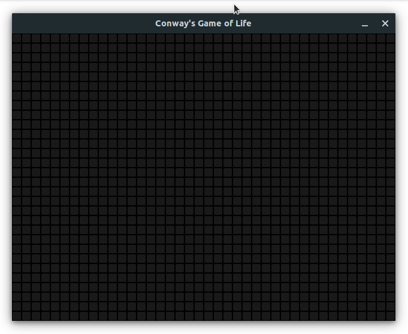

# Preview

<p align="center">
    
</p>

# Usage

- Left click to make a cell alive
- Right click to make a cell dead
- Spacebar to play/pause
- Left arrow to slow down, right arrow to speed up

# Downloads

- [Windows](https://github.com/jasonliang512/game-of-life/releases/download/v1.0/game-of-life-windows-x64.zip)
- [Linux](https://github.com/jasonliang512/game-of-life/releases/download/v1.0/game-of-life-linux.zip)

# Building

Install pkg-config, SDL2, SDL2_image, then run the commands below:

```
mkdir build
cd build
cmake ..
make
./GameOfLife
```
